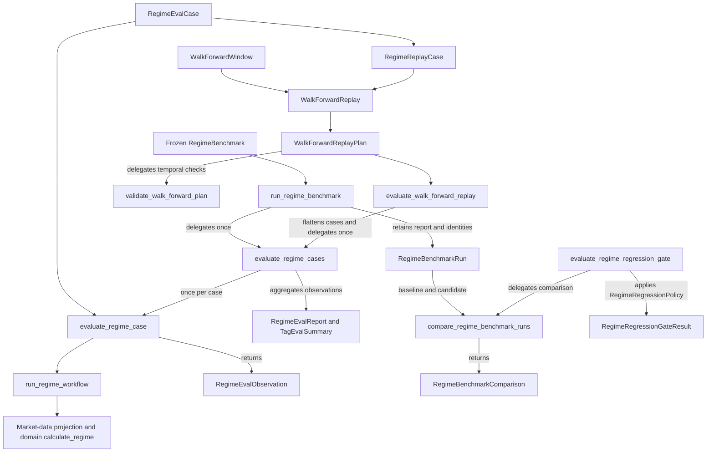

# Finance Research Agent

An open-source AI-assisted market research and portfolio decision-support system.

## Goals

This project is designed to explore practical AI Agent Engineering concepts including:

- Agent Skills
- deterministic financial tools
- structured market data
- declarative workflows
- evaluations
- human-in-the-loop decision making
- agent runtimes
- MCP
- production automation

## Safety Boundary

This project is designed for research and decision support.

It does not automatically execute trades.

Human approval remains the final decision gate.

## Development Roadmap

- v0.1 Deterministic Research Core + First Market Regime Skill
- v0.2 Data Layer
- v0.3 Workflow
- v0.4 Evals — complete
- v0.5 Agent Runtime — next; not implemented
- v0.6 MCP
- v0.7 Automation / Production

## Status

v0.1.0 is released with a deterministic, synthetic-data-only market-regime core.
v0.2 includes an offline-tested, market-data-only Alpaca historical daily-bars
client that maps fully materialized SDK responses into the provider-independent
normalization boundary. Default tests require no credentials or network access;
trading remains unavailable.

v0.3 adds provider-independent application orchestration around historical-data
and deterministic market-regime capabilities. The application depends on the
provider-neutral `HistoricalBarsFetcher` port, supplied by the Alpaca adapter;
request-global failures remain provider-neutral. The workflow remains
offline-testable, and trading remains unavailable.

v0.4 Evals is complete for its deterministic, offline evaluation scope. The
closeout audit covers the implementation through merged PR #17 at
`ce618fb64e13a709f8b62958d6a8f830aacfc5bc`. The layers compose the existing
workflow, market-data contracts, and report metrics without introducing another
evaluation engine. The next milestone is **v0.5 Agent Runtime**, which requires
a separately approved design; this closeout adds no runtime capability.

## v0.4 architecture and public API

The supported eval entry point is `finance_research_agent.evals`. The following
inventory covers all 21 names in its explicit `__all__`; the linked modules
contain their signatures and contract docstrings.

| Layer | Public API | Responsibility |
| --- | --- | --- |
| [Case evaluation](src/finance_research_agent/evals/regime.py) | `RegimeEvalCase`, `RegimeEvalObservation`, `evaluate_regime_case` | Freeze caller-supplied historical outcomes, policy, cutoff, expected regime, and tags; run the existing regime workflow once; record expected versus actual regime. |
| [Aggregate evaluation](src/finance_research_agent/evals/regime.py) | `RegimeEvalReport`, `TagEvalSummary`, `evaluate_regime_cases` | Evaluate a nonempty tuple with unique case IDs in caller order; own aggregate counts, accuracy, confusion counts, and per-tag summaries. |
| [Frozen benchmark execution](src/finance_research_agent/evals/regime_benchmark.py) | `RegimeBenchmark`, `build_regime_benchmark_v1`, `RegimeBenchmarkRun`, `run_regime_benchmark` | Define a named/versioned corpus sharing one complete policy; build the four authored synthetic v1 cases; attach benchmark, policy, and caller-supplied system identity to the aggregate evaluator's original report. |
| [Benchmark comparison](src/finance_research_agent/evals/regime_benchmark.py) | `RegimeBenchmarkComparison`, `compare_regime_benchmark_runs` | Check matching benchmark name/version and policy version, then return candidate-minus-baseline report accuracy with both revision labels. |
| [Temporal contracts](src/finance_research_agent/evals/temporal.py) | `WalkForwardWindow`, `validate_walk_forward_plan` | Validate strictly separated UTC training/evaluation bounds and caller-ordered, nonoverlapping evaluation windows. |
| [Point-in-time replay](src/finance_research_agent/evals/regime_replay.py) | `RegimeReplayCase` | Wrap an existing case; require its cutoff to equal decision time and every outcome's evidence cutoff to be no later than that decision. |
| [Walk-forward orchestration](src/finance_research_agent/evals/walk_forward_replay.py) | `WalkForwardReplay`, `WalkForwardReplayPlan`, `evaluate_walk_forward_replay` | Bind replay cases to closed evaluation intervals, validate temporal order and global case-ID uniqueness, then flatten cases into the existing aggregate evaluator. |
| [Regression policy](src/finance_research_agent/evals/regime_regression.py) | `RegimeRegressionPolicy`, `RegimeRegressionGateResult`, `evaluate_regime_regression_gate` | Apply an absolute accuracy floor and allowed degradation to compatible benchmark runs, retaining original metrics and deterministic failure reasons. |



`evaluate_regime_case` calls the provider-independent `run_regime_workflow`,
which projects available `HistoricalDailyBars` through `to_market_snapshot`
and calls the domain's `calculate_regime`. Per-symbol `HistoricalBarsFailure`
outcomes remain unavailable evidence, never fabricated bars. Replay uses this
same path over preconstructed cases; it does not invoke the historical fetcher
or Alpaca adapter. Domain, market-data, and application modules do not depend
on evals, and evals has no transport dependency.

The dependency audit found no duplicated evaluation engine, aggregate metric
calculation in orchestration, or reversed layer dependency. Benchmark execution
and walk-forward replay delegate once to `evaluate_regime_cases`; comparison
reads report accuracy; the regression gate reuses comparison. Replay owns
decision/evidence relationships, while market data owns bar, request, session,
and provenance validation. The UTC predicate is repeated at separate temporal
and replay input boundaries; this small local check does not duplicate replay
or market-data validation and does not warrant a shared framework.

The API audit retains all existing exports. Names distinguish inputs,
observations/reports, runs/comparisons, and policy decisions. `TagEvalSummary`
is intentionally public as the report's per-tag result. Metadata validators,
the shared case-ID uniqueness helper, synthetic fixture helpers, and the
regression tolerance constant remain internal and are not package exports.

Single-case mismatches produce `passed=False`; programmer/domain errors
propagate. Aggregate evaluation rejects empty or duplicate-ID collections before
execution and returns no partial report on errors. `confusion_counts` is a
read-only mapping of all 16 `(expected, actual)` regime pairs, including zeros.
Tag summaries are ordered by tag name; cases with multiple tags contribute once
to each, so tag totals need not sum to the overall total. Tags do not affect
classification. Case IDs and tags use canonical lowercase ASCII tokens with
optional single underscore/hyphen separators; they are rejected rather than
normalized. Temporal and replay details, identity rules, and the regression
gate's numerical boundary behavior are documented below.

## What v0.4 establishes and what it does not

v0.4 supports deterministic capability evaluation, aggregate regime evaluation,
reproducible benchmark identity/comparison, temporal walk-forward contracts,
point-in-time evidence-cutoff validation, and a deterministic regression policy.
Its accuracy measures agreement with caller-authored regime labels for the
supplied cases. The built-in benchmark has four synthetic scenarios with a
frozen policy and a weekday-only schedule, not an exchange calendar or observed
IEX data. It is not representative of real market frequencies.

The milestone does **not** establish:

- Investment alpha, profitable trading, or portfolio performance.
- Realistic transaction execution, fills, slippage, fees, or a trading backtest.
- Historical publication/revision correctness when source data lacks that
  metadata. Cutoff checks validate supplied timestamps, not historical truth.
- External benchmark performance or live provider reliability.
- LLM-agent quality; no LLM judge or agent runtime is implemented.
- Production CI enforcement. The gate is a callable policy; baseline selection,
  policy choice, invocation, and release decisions remain caller responsibilities.

Training intervals are contractual: replay does not fit models or enforce how
the caller developed or tuned the system. An inspected-and-retuned holdout is
no longer untouched. Benchmark comparability trusts caller-maintained corpus
and policy versions and the supplied system revision; it does not verify a
corpus fingerprint, formula version, or the code associated with that revision.
These limitations bound the closeout claim; a passing gate is not approval to
trade or evidence of general market performance.

## Release readiness

The closeout audit found no production-code or public-export correction needed.
Existing tests cover delegation, metric reuse, invalid inputs, temporal and
evidence boundaries, error propagation, immutability, and regression tolerance;
this documentation closeout adds no tests. Local verification at closeout:
`pytest` (545 passed; one existing `websockets.legacy` deprecation warning),
`ruff check .`, `mypy src` (23 source files), and `git diff --check`.
These local checks do not imply automated CI enforcement.

The repository has a GitHub `v0.1.0` release/tag and two existing package-version
fields: `project.version` in `pyproject.toml` and `__version__` in
`src/finance_research_agent/__init__.py`, both `0.2.0.dev0`. They remained unchanged
through the v0.3 closeout and v0.4 implementation. No release procedure requires
a version bump for this documentation closeout, so both are retained.

After this PR is reviewed and merged, the recommendation is a **v0.4.0 GitHub
release/tag** on the reviewed release commit. Before publishing, explicitly
decide whether to align both existing package-version fields to `0.4.0`; an
installable package advertised as `0.4.0` should report that version consistently.
Milestone completion here does not mean a release has been published. This PR
creates no tag/release or packaging infrastructure.

## Deterministic regime benchmark comparison

v0.4 includes a frozen synthetic benchmark with four explicitly labeled cases.
Each `RegimeBenchmarkRun` keeps separate identities for the benchmark definition
(`benchmark_name`, `benchmark_version`), evaluation configuration
(`policy_version`), and system under test (`system_revision`). Its original
`RegimeEvalReport` owns all metrics: total, passed, failed, accuracy, confusion
counts, and tag summaries.

Supply the revision explicitly for every run:

```python
from finance_research_agent.evals import (
    build_regime_benchmark_v1,
    run_regime_benchmark,
)

run = run_regime_benchmark(
    build_regime_benchmark_v1(),
    system_revision="build_2026_09_08",
)
```

Revisions are preserved exactly and must match
`[A-Za-z0-9]+(?:[._-][A-Za-z0-9]+)*`: ASCII letters or digits with optional single
dot, underscore, or hyphen separators. Git SHAs, `v0.5.0`, and
`build_2026_09_08` are valid. Blank values, whitespace, non-ASCII characters,
paths, and repeated or leading/trailing separators are rejected before evaluation.
The caller is responsible for identifying the code actually evaluated; assigning
a revision does not switch code. Eval code does not discover revisions from Git,
shell commands, environment variables, or network access.

Use `compare_regime_benchmark_runs(baseline, candidate)` on runs produced by the
respective systems. It requires equal benchmark names, benchmark versions, and
policy versions, raising `ValueError` for a mismatch before reading accuracy.
System revisions may differ; the same revision is also valid for replay checks.
The immutable `RegimeBenchmarkComparison` contains `baseline_revision`,
`candidate_revision`, and `accuracy_delta`. The delta is always
`candidate.report.accuracy - baseline.report.accuracy`: 0.75 to 1.00 gives +0.25
(25 percentage points), and the reverse gives -0.25. Comparison reads report
accuracy directly and does not evaluate cases again.

`formula_version` is deferred in this slice. The public domain `RegimeResult`
contains it, but the existing evaluation observation/report contract does not
retain it, and the domain exposes no public formula-version constant. This slice
preserves that boundary without extra evaluation or copying a version literal.
Comparability therefore does not currently check formula versions. Benchmark
version remains the explicit corpus contract; callers must update the benchmark
version for corpus changes and the policy version for configuration changes.
No benchmark fingerprint or execution timestamp is added. These synthetic results
measure deterministic scenario behavior, not predictive alpha or trading performance.

## Deterministic benchmark regression gate

v0.4 Slice 5 adds `RegimeRegressionPolicy`, `RegimeRegressionGateResult`, and
`evaluate_regime_regression_gate` to the public eval API. A metric describes an
evaluation outcome; a gate applies a caller-supplied release-quality policy to
those metrics. `RegimeEvalReport` continues to own accuracy, and
`compare_regime_benchmark_runs` continues to own compatibility checks and the
candidate-minus-baseline accuracy delta.

`RegimeRegressionPolicy` is a frozen, slotted dataclass with two independent
thresholds:

- `minimum_accuracy`: the absolute candidate accuracy floor.
- `maximum_accuracy_regression`: the maximum allowed degradation, expressed as
  a nonnegative magnitude. A value of `0.02` allows a delta of at least `-0.02`
  (two percentage points of accuracy), not a relative two-percent decline.

Both thresholds must be finite `int` or `float` values in `[0.0, 1.0]`.
Booleans, other types, NaN, infinity, and out-of-range values raise `ValueError`.
Accepted values are preserved without conversion or clamping. This release gate
policy is separate from the regime evaluation configuration identified by a
benchmark run's `policy_version`.

For caller-supplied `baseline` and `candidate` benchmark runs:

```python
from finance_research_agent.evals import (
    RegimeRegressionPolicy,
    evaluate_regime_regression_gate,
)

policy = RegimeRegressionPolicy(
    minimum_accuracy=0.75,
    maximum_accuracy_regression=0.02,
)
result = evaluate_regime_regression_gate(baseline, candidate, policy)
```

The gate delegates once to `compare_regime_benchmark_runs(baseline, candidate)`
before reading candidate report accuracy. Incompatible benchmark names,
benchmark versions, or evaluation policy versions raise the existing `ValueError`;
they do not become quality failures. Benchmarks and cases are not evaluated
again, and the gate does not duplicate accuracy or delta calculations.

The mathematical policy requires candidate accuracy at or above the floor and
candidate-minus-baseline delta at or above the negative regression limit. The
implemented pass equation includes an explicit numerical-comparison tolerance
only at a positive regression limit:

```python
regression_passed = accuracy_delta >= -maximum_accuracy_regression or (
    maximum_accuracy_regression > 0.0
    and math.isclose(
        accuracy_delta, -maximum_accuracy_regression,
        rel_tol=0.0, abs_tol=1e-12,
    )
)
passed = candidate_accuracy >= minimum_accuracy and regression_passed
```

With a floor of `0.75` and maximum regression of `0.02`:

| Baseline accuracy | Candidate accuracy | Absolute check | Regression check | Result |
| --- | --- | --- | --- | --- |
| 0.80 | 0.79 | Pass | Pass | PASS |
| 0.95 | 0.90 | Pass | Fail | FAIL |
| 0.70 | 0.74 | Fail | Pass | FAIL |
| 0.95 | 0.70 | Fail | Fail | FAIL |

Boundary equality passes both checks. The regression comparison uses a fixed
absolute tolerance of `1e-12` in accuracy units (`1e-10` percentage points), with
relative tolerance disabled. This small allowance absorbs binary subtraction
artifacts without scaling with the configured regression limit. A delta below
the boundary by more than this allowance fails. Numerical differences within
this allowance are treated as equality only for the regression decision; no
stored or reported metric is rounded or changed. The absolute accuracy floor
remains strict, so even an immediately lower float fails that check.

For an exactly representable example, baseline `0.9375` and candidate `0.90625`, with floor
`0.85` and maximum regression `0.03125`, PASS: candidate accuracy exceeds the
floor and the delta is exactly `-0.03125`. Zero allowed regression accepts an
unchanged or improved accuracy and rejects every negative delta.

Decimal-looking values may not produce an exact decimal difference in binary
floating point. Baseline `0.92` and candidate `0.90` produce the existing delta
`-0.020000000000000018`. With floor `0.85` and maximum regression `0.02`, both
checks now PASS: the mathematical two-percentage-point regression is exactly
allowed, and its float representation is within the explicit boundary tolerance.
The result still reports candidate accuracy `0.90` and delta
`-0.020000000000000018`. A genuinely larger regression, such as `0.92` to `0.89`,
still FAILS. A zero regression limit disables the numerical allowance entirely,
so it rejects every negative delta, including declines smaller than `1e-12`.

`RegimeRegressionGateResult` is frozen and slotted. It retains `passed: bool`,
the original `candidate_accuracy: float`, the original `accuracy_delta: float`,
and `failures: tuple[str, ...]`. Passing results have an empty failure tuple.
Failures use fixed strings in deterministic order, with both included when
both checks fail:

1. `"candidate accuracy below minimum"`
2. `"accuracy regression exceeds maximum"`

The result explains the decision without recalculating metrics. Retain the
policy and runs alongside it when their thresholds and identities are needed.
Same inputs produce the same result without clock, network, Git, environment,
process, filesystem, or random dependencies. This slice is a reusable eval
policy, not CI integration: it does not discover a baseline or revision, print
annotations, exit the process, write files, or add a workflow, CLI, configuration
format, persistence, serialization, or runtime dependency.

## Temporal evaluation contracts

v0.4 Slice 4A adds `WalkForwardWindow` and `validate_walk_forward_plan` to the
public `finance_research_agent.evals` API. These contracts describe temporal
boundaries for future walk-forward evaluation; they do not select data, train
models, download history, or run historical replay or backtesting.

`WalkForwardWindow` is a frozen, slotted dataclass with `train_start`, `train_end`,
`eval_start`, and `eval_end` datetime fields. Training and evaluation use closed
intervals, `[train_start, train_end]` and `[eval_start, eval_end]`, with positive
duration and strict separation:

```text
train_start < train_end < eval_start < eval_end
```

All four timestamps must already be timezone-aware with zero UTC offset,
matching the existing datetime validation convention. Naive datetimes and
nonzero-offset datetimes are rejected, not converted. Zero-offset timezone
objects are accepted without requiring identity with `datetime.UTC`; the
supplied datetime objects are preserved.

`validate_walk_forward_plan(windows)` requires a nonempty tuple of
`WalkForwardWindow` values and returns `None` on success. It rejects duplicate
windows and checks the supplied order without sorting. Consecutive windows must
satisfy `previous.eval_end < next.eval_start`. Reversed, overlapping, and touching
evaluation periods are rejected; any strictly positive gap is allowed. Invalid
windows and plans raise `ValueError`.

Training periods have no cross-window ordering constraint. Both expanding
training (2018-2020 for evaluation in 2021, then 2018-2021 for evaluation in 2022)
and rolling training (2018-2020, then 2019-2021 for those evaluation years) are
valid. Later training may incorporate previous evaluation outcomes after they
become historical; each window must still end training before its own evaluation
starts. These contracts enforce temporal separation without selecting a
model-development strategy.

Data roles describe permitted influence on the system:

- **Development data** may influence implementation.
- **Validation data** may influence configuration or model selection.
- **Holdout data** must not influence development or tuning before final
  evaluation. Inspecting holdout failures and changing the system contaminates
  the holdout; subsequent results on that data are no longer an untouched final
  evaluation.

For future historical decisions, source information used must have been
available no later than the decision/evidence cutoff. An old observation date
alone does not establish that the information was available at that time.
The existing `HistoricalBarsOutcome` is `HistoricalDailyBars | HistoricalBarsFailure`;
both outcomes carry provenance. Available bars constrain source timestamps to
retrieval and cutoff, while completed sessions must precede the cutoff's New York
market date. A valid window or plan does not verify source availability or provide
a point-in-time dataset.

## Point-in-time regime replay contracts

v0.4 Slice 4B adds `RegimeReplayCase(case, decision_at)` to the public eval API.
It is a frozen, slotted dataclass that preserves the supplied `RegimeEvalCase`
and binds it to an explicit simulated decision time. Construction requires:

```text
case.cutoff_at == decision_at
every outcome.provenance.evidence_cutoff_at <= decision_at
```

Equality at the decision cutoff is allowed. Every outcome is checked, including
`HistoricalBarsFailure` and symbols unused by the regime calculation. Failures
can represent knowledge that data was unavailable; they cannot carry a future
evidence cutoff. Invalid replay inputs raise `ValueError`.

`decision_at` and the wrapped case's `cutoff_at` must already be timezone-aware
datetimes with zero UTC offset, following `WalkForwardWindow`. Naive or nonzero
offset values are rejected without conversion. No timestamp is inferred from
the current clock or retrieval time.

The timestamps describe different facts:

| Field | Meaning |
| --- | --- |
| `DailyBarObservation.source_timestamp` | Source/event time associated with the bar; its New York date must match the bar's session. It is not a publication or revision timestamp. |
| `provenance.evidence_cutoff_at` | Upper bound on the historical evidence used. It becomes the projected market snapshot's `as_of`. |
| `provenance.retrieved_at` | Time this dataset was retrieved; it remains part of provenance and history identity. |
| `RegimeReplayCase.decision_at` | Caller-supplied simulated decision time, also used as the wrapped evaluator's cutoff. |

Retrieval after a historical decision is not itself leakage. Provider-neutral
`HistoricalBarsProvenance` therefore permits retrieval after its evidence cutoff;
the SDK client and standalone Alpaca normalizer retain their live requirement
`retrieved_at <= evidence_cutoff_at`. Existing request bounds, source timestamp
bounds, UTC checks, completed-session validation, and history hashing remain in
force. The replay layer trusts validated market-data objects and does not
duplicate bar or session validation.

For a caller-supplied `historical_case` whose `cutoff_at` is the same UTC instant:

```python
from datetime import UTC, datetime

from finance_research_agent.evals import RegimeReplayCase, evaluate_regime_case

replay = RegimeReplayCase(
    case=historical_case,
    decision_at=datetime(2026, 8, 25, 13, tzinfo=UTC),
)
observation = evaluate_regime_case(replay.case)
```

Evaluation uses the existing regime evaluator unchanged; programmer and domain
errors propagate. Slice 4C composes this contract with `WalkForwardWindow` in the
orchestration layer below.

Using evidence that was unavailable at the simulated decision is leakage.
These contracts check the timestamps the dataset actually carries; they cannot
solve revision leakage without historical publication/revision metadata. An old
bar timestamp or an asserted failure cutoff alone does not prove historical
availability. Callers remain responsible for selecting evidence, including
unavailability outcomes, that was actually knowable at the decision time.

## Walk-forward regime replay orchestration

v0.4 Slice 4C adds `WalkForwardReplay`, `WalkForwardReplayPlan`, and
`evaluate_walk_forward_replay` to the public eval API. This is historical
evaluation orchestration, not a trading backtester.

The three temporal contracts have distinct responsibilities:

| Contract | Responsibility |
| --- | --- |
| `WalkForwardWindow` | Defines the allowed evaluation region and its separation from the training interval. |
| `RegimeReplayCase` | Validates that the supplied evidence cutoffs do not extend beyond decision time and that the case cutoff equals that decision. Historical availability still depends on the supplied provenance. |
| `WalkForwardReplay` | Binds each validated replay decision to the correct evaluation window. |

`WalkForwardReplay(window, cases)` is a frozen, slotted dataclass containing an
existing `WalkForwardWindow` and a nonempty immutable tuple of `RegimeReplayCase`
values. It preserves the supplied objects and case order, rejects duplicate case
IDs, and uses Slice 4A's closed evaluation interval exactly:

```text
window.eval_start <= replay.decision_at <= window.eval_end
```

Both endpoints are accepted. A decision even one microsecond outside the
interval is rejected. The binding composes validated contracts without repeating
the replay's evidence checks or converting timestamps.

`WalkForwardReplayPlan(windows)` is also frozen and slotted. It requires a
nonempty immutable tuple of replay bindings and delegates temporal validation to
`validate_walk_forward_plan`. Window order is preserved without sorting;
duplicate, reversed, overlapping, or touching evaluation windows are rejected.
Expanding and rolling training periods remain valid under Slice 4A's rules.

Case IDs must be globally unique within the plan, including across windows.
An ID identifies one evaluation observation. If the same economic scenario
appears in several windows, give each occurrence a different case ID. Invalid
bindings and plans raise `ValueError` before evaluation.

For the validated `replay` constructed above:

```python
from finance_research_agent.evals import (
    WalkForwardReplay,
    WalkForwardReplayPlan,
    WalkForwardWindow,
    evaluate_walk_forward_replay,
)

window = WalkForwardWindow(
    train_start=datetime(2025, 1, 1, tzinfo=UTC),
    train_end=datetime(2026, 7, 31, 23, 59, 59, tzinfo=UTC),
    eval_start=datetime(2026, 8, 1, tzinfo=UTC),
    eval_end=datetime(2026, 8, 31, 23, 59, 59, tzinfo=UTC),
)
plan = WalkForwardReplayPlan(
    windows=(WalkForwardReplay(window=window, cases=(replay,)),),
)
report = evaluate_walk_forward_replay(plan)
```

The runner flattens the wrapped cases in window order and then case order,
delegates once to `evaluate_regime_cases`, and returns its existing
`RegimeEvalReport` directly. Every case is evaluated once through
`evaluate_regime_case`; observations, accuracy, confusion counts, and tag
summaries keep their existing semantics. Programmer and domain errors propagate
without a partial report. Keep the plan alongside the report when window
diagnostics are needed; globally unique case IDs connect observations to windows.

The training interval is descriptive/contractual today because the system has no
fitting/training stage. It describes the historical period that would be
permitted for system development or configuration before that evaluation window.
The runner evaluates preconstructed cases only; it does not select training data,
fit or tune a model, or enforce how a caller developed the system. Replay evidence
may include information available during the evaluation interval by decision
time; it is not restricted to the training interval.

No clock, network, Git, process, or adapter dependency is added to orchestration.
There is no downloader, portfolio simulation, trading-performance calculation,
persistence, generated timestamp, or new runtime dependency.
