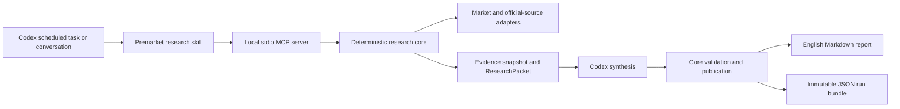
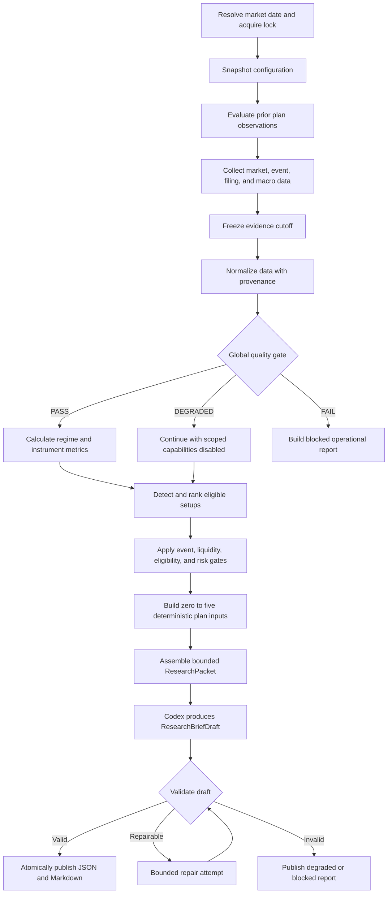

# AI Market Research Agent

## Premarket Research Brief (Product A) — Design Specification

**Document status:** Draft for final user review  
**Design date:** 2026-08-19  
**Product language:** English  
**Initial deployment:** Personal, local-first Codex plugin  
**Primary market:** U.S.-listed common stocks and non-leveraged ETFs  
**Primary market-data provider:** Alpaca Market Data  
**Reference project:** [`tradermonty/claude-trading-skills`](https://github.com/tradermonty/claude-trading-skills)

---

## 1. Executive Summary

This specification defines the first product in a broader `ai-market-research-agent` roadmap: an English-language premarket research brief for a personal core-satellite investing workflow.

The system runs locally through Codex on U.S. market trading days. It targets publication at approximately 09:00 `America/New_York`, produces a three-minute executive brief plus a ten-to-fifteen-minute detailed report, and saves both a human-readable Markdown report and a replayable JSON evidence bundle.

The first version is research-only. It does not connect to brokerage account, position, buying-power, or order APIs. It may generate zero to five conditional long-only trade-plan drafts for explicitly eligible watchlist names, but every plan remains `DRAFT`, `REVIEW_REQUIRED`, `BLOCKED`, or `EXPIRED`. The product never emits `APPROVED`, `EXECUTED`, or an equivalent state and never places an order.

The recommended architecture is:

1. A personal Codex plugin provides the user and scheduled-task entry points.
2. Codex skills define the fixed research workflow.
3. A local stdio MCP server exposes a narrow, schema-validated research tool surface.
4. A provider-independent deterministic Python core collects and normalizes evidence, computes indicators, applies eligibility and risk gates, and validates outputs.
5. Codex performs evidence-bounded synthesis and English report writing.
6. The core validates the structured draft before atomically publishing JSON and Markdown artifacts.

The architecture deliberately keeps the deterministic research engine independent of Codex. The first version uses Codex runtime synthesis without requiring a separate OpenAI API key. A future `ResearchSynthesizer` adapter may support OpenAI API, other hosted models, or local models without replacing the core.

## 2. Product Roadmap and Decomposition

The eventual product family contains four independently designed products:

1. **A — Premarket Research Brief:** the product specified here.
2. **B — Holdings and Watchlist Monitor:** future live or manually supplied holdings, portfolio heat, thesis monitoring, and alerts.
3. **D — After-Close Review:** future daily close review, thesis updates, and decision journaling.
4. **C — Whole-Market Candidate Discovery:** future broad-universe scanning, liquidity controls, data licensing, ranking evaluation, and false-positive management.

The planned implementation order is `A → B → D → C`. Each later product requires its own design specification and implementation plan. Product A must not silently expand into whole-market scanning or holdings management.

## 3. Design Decisions

The following decisions are approved and normative for Product A:

- The market scope is U.S. stocks and ETFs.
- The investing framework is core-satellite.
- Core assets are monitored for risk and material change.
- Satellite plans target growth and momentum swing setups lasting days to weeks.
- The report targets approximately 09:00 `America/New_York` on valid U.S. trading days.
- The system is local-first and may run only while the computer and Codex are available.
- The first user interface is a personal Codex plugin.
- The implementation uses a local MCP server and an independent deterministic core.
- Alpaca Market Data is the primary structured market-data source.
- The first version uses a free or near-zero data budget.
- The research universe is a fixed market radar plus at most 30 user watchlist names.
- The watchlist contains public-research metadata, not holdings, cost basis, or account information.
- Codex conversation is the primary watchlist-management interface; a local YAML file is the source of truth.
- Only long plans for U.S.-listed common stocks and non-leveraged, non-inverse ETFs are eligible.
- The supported setup families are breakout continuation and trend pullback.
- A day with no eligible plan is valid and must not be treated as a system failure.
- Candidate ranking and all numeric calculations are deterministic and explainable.
- Codex performs synthesis and writing; it does not calculate or alter risk limits.
- Position sizing uses a local static risk policy, never live Alpaca account data.
- The product returns a Codex summary and saves Markdown plus structured JSON.
- All source code, schemas, prompts, skills, configuration, logs, tests, documentation, report text, and generated artifacts are in English.
- The first release is personal. The repository must remain suitable for later publication on GitHub without committing personal data, credentials, generated reports, or licensed third-party content.
- The first 20 trading days operate in shadow mode.

## 4. Goals

Product A must help the user answer, before the regular U.S. session opens:

1. What is the current market posture?
2. Which scheduled macroeconomic, company, filing, or market events matter today?
3. What materially changed since the prior valid report?
4. Which core assets or market proxies show meaningful risk changes?
5. Which watchlist names deserve deeper review today, and why?
6. Are any long-only breakout or trend-pullback plans eligible for review?
7. What evidence, counter-evidence, invalidation, expiry, and data limitations apply?
8. Which capabilities are unavailable because data, configuration, or timing is insufficient?

The system must make those answers traceable to timestamped evidence and deterministic calculations.

## 5. Non-Goals

Product A does not include:

- Brokerage account access
- Holdings or cost-basis ingestion
- Buying-power access
- Order creation, modification, cancellation, routing, or monitoring
- Automated execution
- Portfolio rebalancing
- Short selling
- Options, futures, crypto, OTC securities, preferred shares, warrants, or rights
- Leveraged or inverse ETFs
- Whole-market candidate discovery
- Intraday alerting
- A custom web or mobile interface
- Cloud hosting
- Multi-user support
- Public Codex marketplace publication
- Autonomous threshold optimization
- Claims of investment profitability or predictive edge
- A complete after-close review product

## 6. Design Principles

### 6.1 Research before action

The product is a decision-support and evidence-governance system. A plan draft is a conditional research artifact, not an instruction or order.

### 6.2 Deterministic numbers, bounded language-model synthesis

The core owns data normalization, indicators, scoring, gates, prices, sizing, reward-to-risk calculations, and state transitions. Codex owns prioritization, explanation, opposing views, and prose. Codex cannot change core results.

### 6.3 No citation, no factual claim

Every material factual claim must map to evidence. Every calculated claim must map to a versioned calculation. Unsupported material facts block publication.

### 6.4 Point-in-time evidence

Every run freezes an evidence cutoff. Information obtained after the cutoff cannot be inserted into the same revision. Historical reports must remain reproducible without look-ahead.

### 6.5 Fail closed at the affected capability

Missing or conflicting data disables only the capabilities that depend on it when safe isolation is possible. Missing critical market, calendar, event-risk, or risk-policy inputs blocks the corresponding plan capability.

### 6.6 Visible uncertainty

Stale data, single-feed coverage, unresolved conflicts, unknown event risk, and unavailable portfolio heat must be visible near the affected conclusion.

### 6.7 Human-only approval

The system has no approved or executed plan state. The user may act outside the system after independent review, but the product does not record that as execution.

### 6.8 Provider independence

Provider-specific response shapes terminate at adapter boundaries. Domain models and policies do not depend on Alpaca, Codex, or another vendor.

## 7. Selected Architecture

Three architecture families were considered:

1. A skill that directly runs local scripts.
2. A Codex plugin with a local MCP server and an independent deterministic core.
3. A standalone always-on agent service with Codex as a thin interface.

The selected option is **Codex plugin + local MCP + independent deterministic core**. It provides explicit tool contracts, narrow permissions, better secret isolation, deterministic replay, and a clean future migration path without the operational overhead of a daemon.



## 8. Component Responsibilities

| Component | Responsibilities | Exclusions |
|---|---|---|
| Codex scheduled task and conversation | Start runs, present status, accept follow-up questions, invoke watchlist operations | No credential storage, direct brokerage access, or independent numeric calculations |
| Codex plugin skills | Define workflow order, evidence rules, synthesis requirements, repair procedure, and response format | No direct provider HTTP calls or arbitrary tool selection from external content |
| Local MCP server | Load secrets, validate tool inputs and outputs, invoke application services, enforce paths and state, publish artifacts | No arbitrary URL, shell, file, account, position, or order tool |
| Deterministic core | Normalize evidence, calculate metrics, classify regime, detect setups, rank candidates, calculate sizing, enforce gates, validate drafts | No subjective prose generation or policy mutation |
| Provider adapters | Retrieve and translate provider data into domain contracts | No provider-specific models outside the adapter boundary |
| Codex runtime | Produce English structured synthesis from a bounded ResearchPacket | No unsupported facts, policy changes, new sources, or recalculation |
| Artifact store | Save immutable run data, reports, diagnostics, configuration snapshots, and indexes | No secrets and no tracked personal data |
| Future synthesizer adapters | Implement the same ResearchPacket-to-ResearchBriefDraft boundary for other models | Not implemented in v0.1 |

## 9. MCP Tool Surface

The first-version MCP server uses stdio and is started on demand. It does not listen on a TCP port. Its public tool surface is intentionally small:

### 9.1 Read and run tools

- `get_system_status`
  - Returns configuration readiness, provider readiness, current market date, and non-secret diagnostics.
- `validate_configuration`
  - Validates watchlist, risk, regime, setup, and source policy files without modifying them.
- `prepare_premarket_run`
  - Creates or resumes the idempotent run for a market date, snapshots configuration, collects and normalizes data, applies quality checks, computes deterministic analysis, and returns a bounded `ResearchPacket` or an operational failure result.
  - Executes as one bounded application operation under the premarket run deadline. If the caller disconnects, checkpoints permit a later invocation to resume safely; the operation does not require a persistent background daemon.
  - Publishes a deterministic operational report itself when a pre-synthesis hard failure makes a `ResearchPacket` impossible.
- `get_run_status`
  - Returns execution, data-quality, delivery, capability, and error states for a run.
- `get_report`
  - Returns a previously published report by immutable run ID.

### 9.2 Publication tool

- `validate_and_publish_brief`
  - Accepts only a `ResearchBriefDraft` for an existing frozen run.
  - Validates schema, evidence references, numbers, plan states, risk constraints, and language policy.
  - Writes only inside that run's staging directory.
  - Publishes only after all blocking validation rules pass.
- `publish_reduced_report`
  - Finalizes a deterministic reduced report for an existing frozen run when synthesis is unavailable or the bounded repair limit is exhausted.
  - Accepts only a run ID and an allowed failure reason; it does not accept free-form report text.

### 9.3 Watchlist tools

- `list_watchlist`
- `upsert_watchlist_item`
- `remove_watchlist_item`
- `record_run_feedback`

`record_run_feedback` accepts a run ID, bounded rubric scores, optional English improvement notes, and no market or account mutation. It feeds the local shadow-mode scorecard.

Watchlist mutations use strict schemas, return a change summary, create a new configuration version, and become effective only for a new run or revision.

### 9.4 Explicitly absent tools

There is no arbitrary fetch, shell, code-evaluation, file-path, account, position, buying-power, order, or trading tool. Risk policy modification remains a manual, schema-validated local operation in v0.1 so a language-model conversation cannot silently change capital or risk limits.

## 10. Schedule and Run Identity

### 10.1 Target schedule

- The scheduled task starts at `08:45 America/New_York` on valid U.S. market trading days.
- The target publication time is approximately 09:00 New York time.
- New York time is authoritative and automatically reflects daylight-saving transitions.
- The market calendar, not weekday arithmetic, determines valid trading days.

### 10.2 Missed and late windows

- From 09:00 through 09:25, a missed scheduled run may catch up once and is marked `DELAYED`.
- From 09:25 through 09:30, collection may continue, but new plan drafts default to `REVIEW_REQUIRED` because review time is limited.
- After 09:30, the product does not publish a normal premarket trade plan. It saves a `MISSED_WINDOW` report and blocks all new plan drafts.
- After the regular close, it saves only a missed-run record and waits for the next trading day.
- A future `INTRADAY_RESEARCH` run type may support post-open research, but it is outside Product A v0.1.

### 10.3 Identity and revisions

An immutable run identity follows this conceptual form:

```text
market_date: 2026-08-19
run_type: premarket
revision: 1
run_id: premarket-2026-08-19-r1
```

- Automatic invocation creates at most one formal revision for a market date.
- A user-requested rerun creates `r2`, `r3`, and so on.
- A revision is never overwritten.
- The `latest` index is a pointer to the newest valid publication, not a replacement for history.

## 11. End-to-End Run Pipeline



### 11.1 Configuration freeze

The run snapshots and hashes:

- Watchlist
- Market-radar universe
- Risk policy
- Regime policy
- Setup policy
- Source policy
- Schema versions
- Skill and prompt versions

Configuration changed during a run applies only to a new revision.

### 11.2 Evidence freeze

Collection creates `evidence_cutoff_at`. Information retrieved after this timestamp cannot enter the same revision. Refreshing data requires a new revision.

### 11.3 Deterministic analysis

The core computes all metrics, classifications, gates, ranking, price levels, sizing inputs, and plan status. Every result carries its formula or rule version, input evidence references, units, window, calculation timestamp, and quality flags.

### 11.4 Synthesis and validation

Codex receives only a bounded `ResearchPacket` and returns a schema-conforming `ResearchBriefDraft`. The core permits at most two repair attempts against the same frozen packet. Repair cannot introduce new evidence. If validation still fails, the system publishes a deterministic reduced or blocked report rather than the invalid draft.

## 12. Run State Model

The system uses three orthogonal state dimensions.

### 12.1 Execution status

```text
CREATED
COLLECTING
NORMALIZING
ANALYZING
AWAITING_SYNTHESIS
VALIDATING
PUBLISHED
FAILED
SKIPPED
```

### 12.2 Data-quality status

```text
PASS
DEGRADED
FAIL
```

### 12.3 Delivery status

```text
ON_TIME
DELAYED
MANUAL
MISSED_WINDOW
```

A run may therefore be `PUBLISHED`, `DEGRADED`, and `DELAYED` without collapsing those meanings into one label.

## 13. Capability Model

Quality evaluation produces explicit capability flags:

```text
MARKET_SUMMARY_AVAILABLE
REGIME_CLASSIFICATION_AVAILABLE
WATCHLIST_METRICS_AVAILABLE
EVENT_RISK_CHECK_AVAILABLE
SETUP_DETECTION_AVAILABLE
PLAN_DRAFT_AVAILABLE
POSITION_SIZING_AVAILABLE
PORTFOLIO_HEAT_CHECK_AVAILABLE
```

The report names every disabled capability and the reason. A degraded run is not allowed to hide a missing dependency behind a general warning.

## 14. Core Data Contracts

All contracts are English, typed, schema-versioned, and reject unknown fields unless an explicit migration rule permits them.

| Contract | Purpose |
|---|---|
| `RunContext` | Market date, revision, schedule, cutoff, status, and version snapshot |
| `SourceObservation` | Raw provider observation metadata and provenance |
| `EvidenceItem` | A bounded evidence object that a claim may cite |
| `MarketSnapshot` | Normalized price, bar, session, feed, and coverage data |
| `EventRecord` | Macro, company, earnings, filing, or market event |
| `MetricResult` | Versioned deterministic calculation and its inputs |
| `GateResult` | Pass, warning, or block result with reason and evidence |
| `SetupCandidate` | An eligible breakout or pullback candidate with score components |
| `TradePlanDraft` | A conditional, non-approved long research plan |
| `Claim` | Fact, calculation, inference, or hypothesis with references |
| `ResearchPacket` | The bounded synthesis input supplied to Codex |
| `ResearchBriefDraft` | The structured English output returned by Codex |
| `ValidationReport` | Schema, evidence, numeric, policy, and safety results |
| `PlanObservation` | Post-publication market-path observations for a prior plan |

### 14.1 Time fields

The system distinguishes:

- `event_time`
- `published_time`
- `observed_at`
- `retrieved_at`
- `evidence_cutoff_at`
- `generated_at`
- `market_date`
- `period_end`
- `filing_date`

Machine timestamps use UTC. Human market-time displays use `America/New_York` and may also show UTC.

### 14.2 Provenance fields

A normalized market value includes at least:

```json
{
  "instrument_id": "AAPL",
  "value": 192.34,
  "currency": "USD",
  "session": "PRE_MARKET",
  "provider": "alpaca",
  "feed": "iex",
  "coverage": "single_exchange",
  "observed_at": "2026-08-19T12:58:00Z",
  "retrieved_at": "2026-08-19T12:58:02Z",
  "evidence_id": "ev_example",
  "quality_flags": []
}
```

The report cannot describe this observation as consolidated U.S. market volume.

## 15. Claim and Evidence Rules

Each material report claim has an ID and one of four types:

- `FACT`: directly supported by at least one relevant `EvidenceItem`.
- `CALCULATION`: references a `MetricResult`; displayed values, units, period, and direction must match.
- `INFERENCE`: references one or more facts or calculations and uses calibrated language.
- `HYPOTHESIS`: includes supporting evidence, counter-evidence, invalidation, and expiry.

Rules:

- A source link that does not support the claim is not a valid citation.
- Structured numeric facts are machine-checked against evidence fields.
- Textual entailment is structurally constrained by excerpts and sampled during human evaluation; citation existence alone is insufficient.
- Lower-tier evidence cannot silently override a regulator, official filing, exchange, or official company source.
- Material conflicts remain visible and create `SOURCE_CONFLICT`.
- Unresolved material conflicts block affected plans.
- Evidence obtained after `evidence_cutoff_at` is prohibited in the revision.

The report's Markdown may render citations as linked evidence IDs or footnotes. The JSON claim map remains canonical.

## 16. Source Strategy

### 16.1 Market data

Alpaca Market Data is the primary structured provider. The implementation must treat entitlement and feed as data, not assumptions. Every artifact identifies the provider, feed, coverage, session, observation time, retrieval time, and freshness.

For the user's initial free-tier configuration:

- Current premarket observations are expected to use IEX coverage where applicable.
- IEX is a single-exchange view and cannot be described as full-market activity.
- Previous completed-session and other eligible historical data are handled separately from current IEX observations.
- Rate limits and data-access restrictions are enforced by the adapter and source policy.
- Current premarket volume is supporting context, not a consolidated breakout confirmation.

The v0.1 application imports market-data functionality only. It does not import or expose broker order, account, position, or buying-power operations.

### 16.2 News and event discovery

Provider news may discover events, but material claims should return to a regulator, official filing, company investor-relations release, or other authoritative source when available.

The product stores only permitted metadata, short bounded excerpts, source URLs, timestamps, and hashes for licensed news. It does not commit full articles or provider datasets to Git.

### 16.3 Regulatory and company evidence

- SEC EDGAR provides filing and submission evidence.
- Official company investor-relations sources verify earnings, guidance, and material announcements when configured or safely discovered.
- A model-supplied URL is never fetched.
- User-configured official sources use HTTPS, domain validation, response-size limits, content-type checks, and redirect restrictions.

### 16.4 Macroeconomic evidence

Federal Reserve, BLS, BEA, and other official release calendars provide event timing and published data. If the required macro event calendar is unavailable, new plan drafts are blocked because event risk is unknown.

### 16.5 Fixed market radar

The initial radar contains:

- Broad-market ETFs: `SPY`, `QQQ`, `IWM`, and `DIA`.
- Eleven U.S. sector ETFs: `XLC`, `XLY`, `XLP`, `XLE`, `XLF`, `XLV`, `XLI`, `XLB`, `XLRE`, `XLK`, and `XLU`.
- Cross-asset proxies for long-duration Treasuries, high-yield credit, investment-grade credit, the U.S. dollar, gold, and oil.
- An official volatility series when available, with realized-volatility and ATR-based fallback features.

The radar is versioned and configurable. Changes apply only to a new run revision.

## 17. Watchlist Model

The watchlist contains at most 30 research names. Codex conversation is the primary management interface; `watchlist.yaml` is the local source of truth.

Each item includes:

- `symbol`
- `role`
- `research_rationale`
- `tags`
- `priority`
- `research_horizon`
- `expires_on`
- `benchmark_symbol`
- `sector_proxy_symbol`
- `official_sources`
- `notes`

All stored free-form rationale and notes are English. Codex may accept a Chinese conversation command, but it translates and normalizes the requested content before calling the watchlist tool. The tool returns the stored English representation in its change summary. The original conversational message is not copied into the project configuration.

Allowed roles are:

```text
CORE_MONITOR
SATELLITE_ELIGIBLE
RESEARCH_ONLY
```

- `CORE_MONITOR` receives risk and material-change monitoring but no default swing plan.
- `SATELLITE_ELIGIBLE` may enter setup detection.
- `RESEARCH_ONLY` may appear in research but not sizing or plan generation.

A `SATELLITE_ELIGIBLE` item must have enough metadata to calculate benchmark and sector-relative strength. Missing required metadata blocks plan eligibility but does not remove the item from the report.

The watchlist stores no holdings, cost basis, account identifier, or broker data.

## 18. Configuration Policies

The runtime snapshots five versioned personal policies:

1. `risk-policy.yaml`
2. `regime-policy.yaml`
3. `setup-policy.yaml`
4. `source-policy.yaml`
5. `watchlist.yaml`

All configuration passes schema validation and atomic write checks.

### 18.1 Risk policy

The risk policy includes:

- `planning_capital_usd`
- `max_risk_per_trade_pct`
- `max_position_pct`
- `minimum_reward_risk_ratio`
- `max_total_portfolio_heat_pct`
- `existing_portfolio_heat_pct`, optional and manually maintained
- `max_concurrent_plan_drafts`
- `allow_fractional_units`
- Regime risk multipliers

No monetary or percentage value is inferred. The shipped example keeps sizing disabled and uses clearly non-operational placeholders. Until the user creates a valid private risk policy, `POSITION_SIZING_AVAILABLE` is false.

### 18.2 Setup policy

The setup policy includes explicit values for:

- Required historical sessions
- Minimum price
- Minimum median dollar volume
- Moving-average windows
- Trend-slope windows
- Breakout lookback
- ATR window
- Entry-zone ATR buffers
- Extension limits
- Pullback support tolerances
- Re-strengthening conditions
- Minimum reward-to-risk
- Plan lifetime
- Earnings blackout window

If required eligibility thresholds are absent, setup detection may still display research metrics, but `PLAN_DRAFT_AVAILABLE` is false.

### 18.3 Source policy

The source policy defines:

- Allowed provider and official-source adapters
- Freshness by data type
- Cache retention
- Request deadlines
- Retry limits
- Per-run request budgets
- Allowed domains and redirects
- Licensed-content persistence rules

## 19. English Report Structure

The Markdown report is deterministically rendered from the validated structured draft.

### 19.1 Three-minute executive brief

1. `Run Status`
2. `Market Posture`
3. `What Changed`
4. `Today’s Event Clock`
5. `Core Market Risks`
6. `Watchlist Priorities`
7. `Trade Plan Drafts`
8. `Data Warnings`

The executive brief must communicate posture, major events, top watchlist priorities, plan availability, and disabled capabilities without requiring the reader to open the detailed section.

### 19.2 Detailed research brief

1. `Market Regime`
2. `Macro and Event Calendar`
3. `Broad-Market Radar`
4. `Sector Rotation`
5. `Cross-Asset Risk Signals`
6. `Core Monitor`
7. `Watchlist Dashboard`
8. `Eligible Setups`
9. `Trade Plan Drafts`
10. `Blocked and Excluded Candidates`
11. `Changes Since Prior Run`
12. `Data Quality and Limitations`
13. `Evidence Index`
14. `Methodology and Risk Notice`

All watchlist names remain visible with a concise state or exclusion reason. The report must not display only selected winners.

### 19.3 Language policy

Allowed examples:

- `The setup is eligible for review if...`
- `A draft entry zone is...`
- `The hypothesis would be invalidated if...`
- `No plan is eligible under the current regime.`

Prohibited examples:

- `Buy now.`
- `You should enter immediately.`
- `Guaranteed upside.`
- `This is a safe trade.`
- `The stock will reach...`

Limitations and counter-evidence appear near the affected conclusion, not only in a closing disclaimer.

## 20. Market-Regime Model

Market regime is deterministic and uses five components:

| Component | Initial weight | Inputs |
|---|---:|---|
| `BROAD_TREND` | 30% | `SPY` and `QQQ` trend structure |
| `PARTICIPATION` | 25% | Eleven-sector trend breadth |
| `LEADERSHIP` | 20% | Growth, small-cap, cyclical, and defensive relative strength |
| `VOLATILITY_STRESS` | 15% | SPY realized volatility, ATR percentage, and optional official volatility data |
| `CREDIT_CROSS_ASSET` | 10% | Credit, Treasury, dollar, gold, and oil proxies |

Each component returns:

```text
+1  POSITIVE
 0  MIXED
-1  NEGATIVE
NA  UNAVAILABLE
```

The weighted result ranges from -100 to +100.

### 20.1 Initial classification policy

```text
PERMISSIVE  score >= +35 and no critical stress flag
NEUTRAL     score from -34 through +34
DEFENSIVE   score <= -35 or a critical stress flag is active
UNKNOWN     broad trend is unavailable, or too many required components are unavailable or conflicting
```

The component rules and thresholds are versioned in `regime-policy.yaml`. The initial implementation uses completed daily bars and transparent trend, breadth, relative-strength, and volatility-percentile rules. It does not fit weights to the initial 20-day shadow sample.

The initial component classifications are deterministic:

- `BROAD_TREND` is `POSITIVE` when both `SPY` and `QQQ` are above their 50-day and 200-day moving averages and both 50-day averages have risen over the preceding 20 completed sessions. It is `NEGATIVE` when both are below their 50-day averages, both 50-day slopes are negative, and at least one is below its 200-day average. Other valid combinations are `MIXED`.
- `PARTICIPATION` is `POSITIVE` when at least seven of the eleven sector ETFs are above rising 50-day averages. It is `NEGATIVE` when no more than four are above their 50-day averages. Other valid combinations are `MIXED`. Fewer than nine valid sector series makes the component `UNAVAILABLE`.
- `LEADERSHIP` evaluates three 20-session relative-return observations: `QQQ` versus `SPY`, `IWM` versus `SPY`, and an equal-weight cyclical-sector basket versus an equal-weight defensive-sector basket. At least two positive observations produce `POSITIVE`; at least two negative observations produce `NEGATIVE`; otherwise the result is `MIXED`. Fewer than two valid observations makes it `UNAVAILABLE`.
- `VOLATILITY_STRESS` compares SPY 20-session realized volatility and 14-session ATR percentage with their trailing 252-session distributions. Both at or below the 60th percentile produce `POSITIVE`; either at or above the 80th percentile produces `NEGATIVE`; other valid combinations are `MIXED`. An available official volatility series is corroborating evidence and may activate a critical-stress rule defined in policy.
- `CREDIT_CROSS_ASSET` is `POSITIVE` when the 20-session relative return of `HYG` versus `LQD` is positive and `HYG` is above a rising 50-day average. It is `NEGATIVE` when that relative return is negative and `HYG` is below a falling 50-day average. Other valid combinations are `MIXED`. Treasury, dollar, gold, and oil proxies remain visible contextual evidence and may activate explicit policy flags; they do not silently change the component sign.

`UNKNOWN` is mandatory when `BROAD_TREND` is unavailable or when two or more of the other four components are unavailable. A critical-stress flag is limited to versioned, observable conditions, such as a configured extreme-volatility percentile, an exchange-wide market-integrity event, or an unresolved critical-data conflict. Codex cannot activate it from prose.

### 20.2 Regime effect on plans

```text
permissive_minimum_candidate_score: 70
neutral_minimum_candidate_score: 80

permissive_risk_multiplier: 1.00
neutral_risk_multiplier: 0.50
defensive_risk_multiplier: 0.00
unknown_risk_multiplier: 0.00
```

- `PERMISSIVE`: eligible plans may be drafted.
- `NEUTRAL`: only higher-scoring plans are eligible and sizing uses the reduced risk multiplier.
- `DEFENSIVE`: new long satellite plans are blocked.
- `UNKNOWN`: new plans fail closed.

Regime is a risk-environment classification, not a trading signal.

## 21. Event-Risk Overlay

Event risk is independent of the regime score and cannot be offset by a strong trend score.

Relevant events include:

- Earnings
- Guidance or investor-day events
- Verified material announcements
- Material SEC filings
- Federal Reserve decisions and minutes
- CPI, PPI, employment, GDP, and other configured high-impact releases
- Trading halts
- Corporate actions
- Symbol or identity uncertainty

Rules:

- A plan must expire before a verified earnings event inside its planned lifetime; otherwise it is `BLOCKED`.
- Product A does not support a dedicated earnings-gap-risk strategy.
- An important but unverified company event makes the affected plan at least `REVIEW_REQUIRED` and may block it under source policy.
- A halt, unresolved corporate action, or identity uncertainty blocks the instrument.
- High-impact macro events appear in `event_risks` and `no_trade_conditions`.
- Missing required macro calendar data blocks new plans.
- Material information discovered after cutoff requires a new revision.

## 22. Instrument Eligibility

Plan drafts are allowed only for:

- U.S.-listed common stocks
- U.S.-listed non-leveraged, non-inverse ETFs
- Long direction
- Reliable instrument identity
- Sufficient valid historical data
- Policy-compliant price and liquidity

The following are excluded:

- OTC securities
- Preferred shares
- Warrants and rights
- Options
- Futures
- Crypto
- Leveraged ETFs
- Inverse ETFs
- Short plans
- Halted or identity-uncertain instruments

Instrument eligibility is a binary gate and cannot be overridden by a high candidate score or Codex narrative.

## 23. Setup Detection

Only two setup families exist in v0.1.

### 23.1 `BREAKOUT_CONTINUATION`

Required concepts:

- Established positive primary and intermediate trend
- Rising intermediate trend
- Price approaching or clearing a versioned base or resistance level
- Positive relative strength versus benchmark
- Positive or non-deteriorating relative strength versus sector proxy
- Sufficient liquidity
- Acceptable extension from support
- Deterministic invalidation level
- Policy-compliant reward-to-risk
- No blocking event, eligibility, or data-quality condition

The breakout level, lookback, proximity zone, ATR buffers, volume conditions, and extension limits are defined in the versioned setup policy. Current IEX premarket volume is supporting evidence only and never a consolidated-market confirmation.

### 23.2 `TREND_PULLBACK`

Required concepts:

- Existing positive primary trend
- Controlled retracement toward a versioned support reference
- Support such as a moving average, prior breakout level, or recent swing structure
- No confirmed structural trend failure
- Deterministic re-strengthening condition
- Positive longer-window relative strength
- Sufficient liquidity
- Deterministic invalidation level
- Policy-compliant reward-to-risk
- No blocking event, eligibility, or data-quality condition

A large decline without an existing positive trend and a re-strengthening condition is not a trend pullback.

## 24. Candidate Scoring and Selection

Binary gates run before scoring. Only candidates that pass required gates receive a score.

| Score component | Weight |
|---|---:|
| `SETUP_QUALITY` | 25 |
| `TREND_QUALITY` | 20 |
| `RELATIVE_STRENGTH` | 20 |
| `REWARD_RISK_QUALITY` | 15 |
| `LIQUIDITY_QUALITY` | 10 |
| `CATALYST_EVIDENCE_QUALITY` | 10 |

Visible penalties are separate from the positive score:

- `EXTENSION_PENALTY`
- `EVENT_UNCERTAINTY_PENALTY`
- `CORRELATION_CONCENTRATION_PENALTY`
- `DATA_QUALITY_PENALTY`

Missing required data cannot be compensated by unrelated high scores.

Deterministic tie-break order:

1. Higher setup quality
2. Higher relative strength
3. Better reward-to-risk
4. Better data quality
5. Higher liquidity
6. Alphabetical ticker order

The system produces at most five plan drafts and highlights at most three in the executive brief. Zero drafts is a valid outcome.

### 24.1 Duplicate exposure

When several highly correlated candidates qualify, the highest-ranked candidate remains primary and the others become secondary alternatives or receive `DUPLICATE_EXPOSURE`. The report explains shared sector or factor exposure but does not claim to measure the user's actual portfolio concentration.

## 25. Trade-Plan Draft Contract

Every plan includes:

```text
plan_id
run_id
symbol
instrument_name
watchlist_role
direction
setup_type
plan_status
generated_at
evidence_cutoff_at
valid_from
expires_at
market_regime
candidate_score
score_breakdown
thesis
counter_thesis
catalysts
event_risks
entry_condition
entry_zone
invalidation_condition
candidate_stop
target_scenarios
risk_per_unit
reward_risk_by_target
position_sizing
no_trade_conditions
supporting_evidence
counter_evidence
data_quality_flags
review_checklist
```

Rules:

- `direction` is always `LONG` in v0.1.
- `entry_condition` is conditional and cannot be only a standalone price.
- The core calculates entry-zone bounds.
- `candidate_stop` is an analytical invalidation price, not an order.
- Each target scenario includes distance, potential reward, and R multiple.
- Counter-thesis, invalidation, no-trade conditions, evidence, and expiry are mandatory.
- Every price includes its observation timestamp and feed label.

Allowed plan states are:

```text
DRAFT
REVIEW_REQUIRED
BLOCKED
EXPIRED
```

- `DRAFT` means every required automated gate passed, but the plan still awaits independent human review outside the system.
- `REVIEW_REQUIRED` means the research remains useful but at least one explicitly named non-blocking manual check, such as unknown portfolio heat, remains unresolved.
- `BLOCKED` means a hard eligibility, event, data-quality, timing, or risk condition prohibits treating the artifact as a current plan.
- `EXPIRED` means time, price movement, or a newer material event ended the artifact's validity.

The system has no `APPROVED` or `EXECUTED` state. No state transition records or implies that the user traded.

## 26. Position Sizing

Sizing is deterministic:

```text
base_risk_budget
  = planning_capital_usd
  × max_risk_per_trade_pct

adjusted_risk_budget
  = base_risk_budget
  × regime_risk_multiplier

risk_per_unit
  = entry_reference_price
  - candidate_stop_price

units_by_risk
  = floor(adjusted_risk_budget / risk_per_unit)

units_by_position_cap
  = floor(
      planning_capital_usd
      × max_position_pct
      / entry_reference_price
    )

suggested_units
  = min(units_by_risk, units_by_position_cap)
```

All intermediate values are saved. Fractional sizing occurs only if the personal risk policy explicitly enables it; otherwise units round down to whole units.

Sizing is unavailable when:

- Planning capital is missing.
- Required risk-policy fields are missing.
- Stop is not below the long entry reference.
- Risk per unit is zero or negative.
- Reward-to-risk is below policy.
- Current price or stop evidence is stale.
- The plan is expired or blocked.

The output then uses `SIZING_UNAVAILABLE` rather than guessing.

## 27. Portfolio Heat Limitation

Product A does not read real holdings. It can verify per-plan risk and maximum position size but cannot honestly verify actual portfolio heat.

- If the user manually supplies `existing_portfolio_heat_pct`, the core may calculate estimated post-plan heat.
- Without that value, the report sets `PORTFOLIO_HEAT_UNAVAILABLE`.
- A plan with unknown portfolio heat is at most `REVIEW_REQUIRED`.
- Product B may later replace the manual value with a holdings-aware gate.

## 28. Plan Expiry and Observation

A plan becomes stale or invalid when:

- `expires_at` passes.
- Price leaves the allowed entry zone before trigger conditions are satisfied.
- The invalidation condition occurs.
- New material information appears.
- Earnings enter the prohibited window.
- Regime becomes incompatible with a new long satellite plan.
- Data becomes stale, conflicting, or unreliable.
- Instrument eligibility changes.

Prior plans are evaluated at the start of the next available premarket run using completed data through the prior regular close. Observation fields include:

```text
ENTRY_ZONE_NOT_OBSERVED
ENTRY_ZONE_OBSERVED
INVALIDATION_OBSERVED
TARGET_OBSERVED
AMBIGUOUS_SEQUENCE
OBSERVATION_WINDOW_ENDED
```

The system records MFE and MAE after an entry-zone observation. If one daily bar crosses entry, invalidation, or target levels and intraday order is unknown, it records `AMBIGUOUS_SEQUENCE` rather than choosing a favorable sequence.

An entry-zone observation does not imply an order, fill, position, profit, or loss.

## 29. Data-Quality and Failure Handling

### 29.1 Quality levels

- `PASS`: full eligible capability set.
- `DEGRADED`: publish reliable sections and disable affected capabilities.
- `FAIL`: publish only an operational report; no market conclusion or plan.

Quality gates cover:

- Required-source availability
- Freshness
- Feed and coverage disclosure
- Timestamp consistency
- Instrument identity
- Halt and eligibility state
- Sufficient historical data
- Liquidity
- Event-calendar availability
- Risk-policy completeness
- Material source conflicts

### 29.2 Failure matrix

| Failure | Report behavior | Plan behavior |
|---|---|---|
| Market calendar unavailable | Operational report only | All plans blocked |
| Alpaca credentials missing or invalid | Configuration error report | All market analysis and plans blocked |
| Alpaca globally unavailable | Independently verified event information only | All plans blocked |
| Current premarket data unavailable but completed history is valid | Daily trend research with explicit warning | Current-price sizing unavailable; plans at least `REVIEW_REQUIRED` |
| One ticker unavailable | Other tickers continue | Affected ticker blocked |
| Historical bars insufficient | Ticker remains visible with reason | Affected ticker blocked |
| Required macro calendar unavailable | Market report is degraded | New plans blocked |
| Official company verification unavailable | Technical research may remain | Affected plan blocked or review-required under event policy |
| News discovery unavailable | No unsupported catalyst narrative | Technical candidate may remain with reduced event confidence |
| Provider schema drift | No guessed field mapping | Affected capabilities blocked |
| A started Codex task loses synthesis but orchestration can continue | Deterministic reduced report | No synthesized plan draft |
| Codex application or runtime never starts | No run can execute; catch-up rules apply on return | No plan exists |
| Draft invalid after repair limit | Invalid content is not published | Affected plans blocked |
| Atomic publication fails | No formal publication | No plan is considered published |

### 29.3 Cache policy

- Completed historical bars may be reused until a newer completed bar should exist.
- Current quotes and premarket observations have short, source-specific freshness windows.
- Cached data retains original observation and retrieval times.
- Cache read time is never represented as observation time.
- Stale prices cannot drive proximity, risk-per-unit, or sizing calculations.
- Every fallback carries `CACHE_FALLBACK_USED`.

### 29.4 Retry policy

Requests use per-request timeout, capped exponential backoff, jitter, provider `Retry-After`, a maximum attempt count, and run-deadline awareness.

Invalid credentials, permission denial, invalid symbols, malformed configuration, schema validation failure, and unsupported instruments are not blindly retried.

## 30. Crash Recovery and Atomic Publication

Each major stage writes a checkpoint.

- Before evidence freeze, collection may resume in the same unpublished run.
- After evidence freeze, synthesis and validation may retry against the same packet.
- Refreshing evidence creates a new revision.
- A lock uses a lease and heartbeat; file existence alone does not define liveness.
- Crash remnants remain in diagnostics and never appear in the formal report index.
- Publication writes into a staging directory, validates hashes, and atomically renames the complete run directory.
- The `latest` pointer updates only after successful publication.

If Codex disappears after deterministic preparation, the run remains `AWAITING_SYNTHESIS` with a frozen packet and a staged reduced report. A later invocation may resume synthesis against that packet or call `publish_reduced_report`. The MCP process does not claim to publish autonomously after the entire Codex application has stopped.

## 31. Security Model

### 31.1 Secrets

Credential preference order:

1. Secure environment injection into the MCP process
2. macOS Keychain helper
3. A local permission-restricted `.env` ignored by Git

Credentials are never stored in prompts, reports, schemas, examples, logs, run bundles, or `.mcp.json`. Status reports reveal only configured or missing state. Logs redact authorization headers and credential-shaped values.

### 31.2 Broker isolation

- Only a market-data client is constructed.
- Network policy permits configured market-data and official-source hosts only.
- The core has no order, account, position, or buying-power domain model.
- MCP exposes no broker mutation or account tool.
- Static tests scan for unauthorized endpoint and model references.

### 31.3 MCP restrictions

Every tool has strict schemas, enum constraints, collection and length limits, ticker validation, deadlines, path allowlists, and run-state authorization. The MCP server exposes no arbitrary shell, code evaluation, package installation, URL, or filesystem capability.

### 31.4 Prompt injection

All external text is untrusted data. Adapters remove scripts, styles, hidden elements, and executable markup; enforce type and size limits; normalize text; save source hashes; and provide only bounded excerpts or structured facts.

External text cannot select tools, URLs, paths, workflows, instructions, states, or risk parameters. The skill fixes tool order, and model output is accepted only as a structured draft for validation.

### 31.5 Configuration integrity

Configuration mutation follows:

1. Parse
2. Validate
3. Normalize
4. Write to staging
5. Re-read and validate
6. Atomic replace
7. Record version and hash

Ticker, tag, note, and source fields reject path traversal, control characters, hidden Unicode, shell syntax where prohibited, and invalid URLs.

### 31.6 Data and license hygiene

Personal configuration, reports, runs, cache, diagnostics, logs, model inputs, and outputs remain outside tracked source. Git contains only code, schemas, documentation, synthetic fixtures, redacted examples, and required notices.

Full licensed articles and provider datasets are not redistributed. Substantial reused MIT-licensed material retains required copyright and license notices. Source-code licensing for a future public release is a separate release decision; MIT is the recommended candidate.

## 32. Local Artifact Layout

Runtime data uses the configurable `AI_MARKET_RESEARCH_DATA_DIR`:

```text
local-data/
├── config/
│   ├── watchlist.yaml
│   ├── risk-policy.yaml
│   ├── regime-policy.yaml
│   ├── setup-policy.yaml
│   └── source-policy.yaml
├── runs/
│   └── YYYY/
│       └── YYYY-MM-DD/
│           └── premarket-YYYY-MM-DD-rN/
├── reports/
│   └── YYYY/
│       └── YYYY-MM-DD/
├── cache/
├── diagnostics/
└── logs/
```

The JSON run bundle is canonical. Markdown is a deterministic rendering of the validated bundle.

Each run saves:

- Schedule, market date, run ID, revision, and timestamps
- Configuration snapshots and hashes
- Provider, feed, coverage, source, and evidence timestamps
- Permitted evidence snapshots or references
- Normalized data
- Metrics and rule versions
- Gate results and capability flags
- Candidate ranking and exclusions
- Position-sizing intermediates
- ResearchPacket
- Codex structured draft
- Validation results
- Final Markdown
- Skill, prompt, schema, core, plugin, and runtime/model versions
- Errors, retries, fallbacks, conflicts, and degraded states

## 33. Technology Baseline

- Python core and MCP server
- Stdio MCP transport
- Typed domain models and generated JSON Schema
- Centralized HTTP client with timeout, retry, allowlist, and redaction
- Numerical and dataframe utilities for market calculations
- `Decimal` for money, risk, and position sizing
- YAML configuration parsed into strict typed models
- Immutable JSON plus deterministic Markdown
- Offline-first tests
- No database in v0.1

An optional SQLite index may be added later as a rebuildable query accelerator. It must never replace immutable JSON as the source of truth.

## 34. Repository Structure

```text
ai-market-research-agent/
├── .codex-plugin/
│   └── plugin.json
├── .mcp.json
├── skills/
│   ├── premarket-research/
│   │   └── SKILL.md
│   └── watchlist-management/
│       └── SKILL.md
├── src/
│   └── ai_market_research_agent/
│       ├── domain/
│       │   ├── models/
│       │   ├── policies/
│       │   ├── scoring/
│       │   ├── sizing/
│       │   └── state/
│       ├── application/
│       │   ├── run_pipeline/
│       │   ├── research_packet/
│       │   ├── validation/
│       │   └── publishing/
│       ├── adapters/
│       │   ├── alpaca/
│       │   ├── sec/
│       │   ├── macro/
│       │   ├── company_ir/
│       │   ├── filesystem/
│       │   └── synthesizers/
│       ├── mcp_server/
│       ├── rendering/
│       └── cli/
├── schemas/
├── config/
│   └── examples/
├── prompts/
├── templates/
├── evals/
│   ├── scenarios/
│   ├── rubrics/
│   └── shadow-scorecard/
├── tests/
│   ├── unit/
│   ├── contracts/
│   ├── adapters/
│   ├── integration/
│   ├── replay/
│   ├── security/
│   └── fixtures/
├── docs/
│   ├── architecture/
│   ├── methodology/
│   ├── data-sources/
│   ├── security/
│   └── operations/
├── scripts/
├── .env.example
├── .gitignore
├── CHANGELOG.md
├── CONTRIBUTING.md
├── NOTICE
├── README.md
└── dependency-lockfile
```

The CLI supports development, diagnostics, configuration validation, and replay. Codex remains the primary user interface.

Project licensing is selected before public GitHub publication. A `LICENSE` file is added at that release gate; required third-party notices exist from the first commit that reuses covered material.

## 35. Testing Strategy

### 35.1 Unit tests

Unit tests cover:

- Market dates and daylight-saving transitions
- Trading days and holidays
- Indicator calculations
- Regime components and classification
- Setup eligibility
- Candidate scoring and tie-breaking
- Entry, invalidation, target, and reward-to-risk calculations
- Position sizing and rounding
- Risk multipliers
- Missing-policy behavior
- Plan expiry and observations
- Ambiguous same-bar sequences
- Run state transitions
- Configuration hashing
- Idempotency and revisions

### 35.2 Contract tests

Contract tests cover valid payloads, missing fields, unknown fields, invalid enums, oversized inputs, schema versions, timestamp formats, evidence integrity, serialization round trips, and migration rules.

### 35.3 Adapter tests

Adapters use synthetic or redacted fixtures for normal responses, empty responses, authentication errors, rate limits, timeouts, partial data, duplicate and out-of-order bars, corporate-action adjustments, identity mismatch, schema drift, invalid timestamps, unexpected content types, redirect rejection, and oversized documents.

Live Alpaca smoke tests are local and opt-in. GitHub CI requires no live credentials.

### 35.4 Integration and replay tests

An offline pipeline test replays configuration, fixtures, normalization, quality gates, calculations, setup selection, ResearchPacket creation, a saved synthetic ResearchBriefDraft, validation, rendering, and atomic publication.

The same input, policy, and core version must produce identical deterministic metrics, scores, gates, candidate order, sizing, JSON, and Markdown numeric content.

Replay reads frozen artifacts and never refreshes network data.

### 35.5 Security tests

Security tests cover prompt injection, malicious HTML, hidden text, path traversal, absolute paths, shell metacharacters, Unicode confusables, oversized payloads, arbitrary URLs, internal-address fetch attempts, cross-domain redirects, secret redaction, tracked-file secret scanning, unauthorized tools, unauthorized paths, invalid run-state calls, prohibited broker endpoint references, prohibited plan states, imperative language, and source-conflict suppression.

Any security-test failure blocks release.

### 35.6 Failure injection

The test harness injects provider outage, per-symbol failure, stale data, source conflict, missing event verification, LLM timeout, invalid JSON, unsupported claims, numeric mismatch, repair exhaustion, disk failure, interrupted publication, stale lock, duplicate scheduling, machine wake, and post-open invocation.

Each scenario specifies expected execution status, quality status, capability flags, plan status, report banner, error code, and recoverability.

## 36. Evaluation Scenario Set

The initial suite contains at least:

1. Permissive market with a valid breakout
2. Permissive market with a valid pullback
3. Neutral regime with a candidate below the higher threshold
4. Defensive regime with a technically strong but blocked candidate
5. Unknown regime caused by missing critical data
6. No eligible candidates
7. Earnings inside the plan window
8. Material filing discovered after a prior report
9. Conflicting official and media sources
10. Stale premarket quote
11. Correct disclosure of IEX-only premarket data
12. Missing macro event calendar
13. Insufficient history for one symbol
14. Leveraged ETF exclusion
15. Halted or identity-uncertain instrument
16. Entry zone already exceeded
17. Invalid stop relationship
18. Missing planning capital
19. Missing portfolio heat
20. Highly correlated candidates
21. One daily bar touches entry and invalidation
22. Unsupported number inserted by synthesis
23. Irrelevant evidence citation
24. Prompt injection in a news excerpt
25. Run started after 09:30 New York time

These scenarios specify behavior and safety; they do not prove investment profitability.

## 37. Twenty-Trading-Day Shadow Mode

The initial live personal period lasts at least 20 valid U.S. trading days. The system produces research normally but remains disconnected from execution.

### 37.1 Safety gate

- Zero order, account, position, or buying-power tool paths
- Zero credential leaks
- Zero prohibited plan states
- Zero serious prompt-injection escapes
- Zero material writes outside approved paths

### 37.2 Deterministic correctness gate

- All sizing-formula tests pass
- All published numeric claims match core results
- Replay is identical for the same version and inputs
- All expected fail-closed scenarios behave correctly
- No stale current price is used for sizing

### 37.3 Evidence-quality gate

- All material facts have relevant evidence references
- All calculated claims reference `MetricResult`
- Zero serious unsupported material claims
- Feed and coverage limitations are complete
- Material conflicts remain visible
- No post-cutoff evidence appears in a revision

### 37.4 Operational-usefulness gate

Initial targets:

- At least 95% of eligible online days publish inside the target window.
- Normal-provider p95 run duration is no more than 15 minutes.
- Every failure leaves an actionable operational record.
- Median executive-brief review time is no more than three minutes.
- Median detailed-report review time is no more than fifteen minutes.
- The user can identify posture, events, priorities, and disabled capabilities from the executive brief.
- Average personal usefulness is at least 4 out of 5, or the scorecard identifies specific corrective work.

An eligible online day means the computer and Codex are available during the window and there is no total local network outage. Ordinary software defects and handled provider failures are not excluded from the metric.

### 37.5 Plan research metrics

The scorecard records drafts per day, no-draft days, block reasons, entry observations, invalidation observations, target observations, ambiguous sequences, MFE, MAE, expiry, setup distribution, and regime distribution.

It does not call those observations realized profit or loss because actual user execution, fill, slippage, fees, and position size are unknown.

No rule, threshold, or weight changes automatically. A change requires evidence, rationale, a new policy version, offline replay, and re-passing safety and correctness gates.

## 38. Performance and Cost Controls

- Batch provider requests where supported.
- No separate language-model call per ticker.
- One primary ResearchPacket synthesis.
- At most two bounded repair attempts.
- Bounded evidence excerpts.
- Source-specific request budgets.
- A hard run deadline.
- Cache reuse for completed history.
- No retries after the report is no longer timely.

Each run records request counts, response sizes, duration by stage, synthesis attempts, packet size, cache-hit ratio, and deadline consumption.

If the ResearchPacket exceeds its configured size limit, low-priority discovery excerpts are reduced. Required risk warnings, counter-evidence, source metadata, and provenance cannot be removed to save context.

## 39. GitHub and CI Boundary

When the project is placed in Git, tracked content includes code, schemas, documentation, synthetic fixtures, redacted examples, and required notices.

CI runs:

- Formatting and lint checks
- Static type checks
- Unit tests
- Contract tests
- Offline integration tests
- Replay tests
- Security tests
- Secret scanning
- Schema validation
- Documentation and example checks
- Plugin manifest validation

CI does not:

- Connect to an Alpaca brokerage account
- Require real API credentials
- Fetch live market data
- Call a paid language-model API
- Upload runtime data
- Publish personal reports

Before public publication, the release process verifies that Git history contains no secrets, examples are de-identified, generated reports contain no personal data, third-party data is not redistributed, reference attribution is complete, a source-code license has been selected, installation is reproducible, and CI passes.

## 40. Versioning

The following are independently versioned and recorded in every run:

- Core package
- Plugin
- MCP tool contract
- Artifact schemas
- Prompt
- Skill workflow
- Regime policy
- Setup policy
- Risk policy
- Source policy
- Report template
- Codex runtime or model metadata available to the workflow

Schema migration preserves original timestamps, evidence IDs, provider and feed labels, calculation versions, plan terms, and original report content.

## 41. v0.1 Personal Release Boundary

The first release contains:

- Personal local Codex plugin
- Manual and scheduled premarket runs
- Fixed market radar
- Up to 30 watchlist research names
- Alpaca market-data adapter
- SEC and official macro/company evidence adapters
- English executive and detailed reports
- Immutable JSON evidence bundles
- Breakout and pullback detection
- Zero to five conditional plan drafts
- Static local risk policy
- Shadow-mode scorecard
- Offline replay, failure, and security tests
- No execution capability

The release is complete only when the implementation passes the automated gates and begins the 20-trading-day personal shadow period. Graduation from shadow mode changes evaluation status, not the no-execution boundary.

## 42. Future Evolution

### 42.1 Product B

Add holdings and watchlist monitoring, explicit thesis state, live or manually reconciled portfolio heat, and position-aware risk. Broker access, if ever added, must begin read-only and receive a separate threat model and approval.

### 42.2 Product D

Add after-close review, daily decision journal, thesis updates, plan-path analysis, and structured lessons.

### 42.3 Product C

Add whole-market candidate discovery only after defining universe, data licensing, liquidity requirements, rate and cost budgets, ranking evaluation, and false-positive controls.

### 42.4 Multi-provider synthesis

Keep `ResearchPacket` and `ResearchBriefDraft` stable while adding OpenAI API, other hosted model, or local-model adapters. Provider selection and automated model evaluation receive a separate design.

### 42.5 Always-on operation

If local availability becomes insufficient, retain the deterministic core and replace the on-demand orchestration layer with an approved daemon or cloud scheduler. This is not required for v0.1.

## 43. Acceptance Criteria

Product A v0.1 is acceptable when all of the following are true:

1. A valid personal configuration can be created without storing secrets in tracked files.
2. Codex can manage a versioned watchlist of no more than 30 research names.
3. A scheduled or manual run creates an immutable, point-in-time evidence bundle.
4. Alpaca feed, coverage, session, and timestamps are visible in affected market claims.
5. Official-source evidence is used for material filings, macro events, and company events when required.
6. The core deterministically calculates metrics, regime, gates, scores, plan levels, risk, and sizing.
7. Codex synthesis cannot alter those deterministic values.
8. Every material fact and calculation maps to appropriate evidence.
9. Missing, stale, or conflicting data disables the affected capabilities and remains visible.
10. The report contains the approved English executive and detailed sections.
11. Plan drafts are long-only, conditional, expiring, evidence-linked, and human-review-only.
12. The system exposes no account, position, buying-power, order, or execution capability.
13. JSON and Markdown publication is atomic and replayable.
14. Offline test, security, failure, and evaluation suites pass.
15. The system begins a 20-trading-day shadow evaluation using the approved scorecard.

## 44. References

- [tradermonty/claude-trading-skills](https://github.com/tradermonty/claude-trading-skills)
- [tradermonty/hermes-trading-research-agent-work-package](https://github.com/tradermonty/hermes-trading-research-agent-work-package)
- [Codex plugin concepts](https://developers.openai.com/plugins/concepts/plugins)
- [Codex skills](https://developers.openai.com/plugins/concepts/skills)
- [Building Codex plugins](https://developers.openai.com/plugins/build/plugins)
- [Codex automations](https://learn.chatgpt.com/docs/automations)
- [Alpaca Market Data API overview](https://docs.alpaca.markets/us/docs/about-market-data-api)
- [Alpaca Market Data FAQ](https://docs.alpaca.markets/us/docs/market-data-faq)
- [Alpaca historical news data](https://docs.alpaca.markets/us/docs/historical-news-data)
- [SEC EDGAR application programming interfaces](https://www.sec.gov/search-filings/edgar-application-programming-interfaces)
- [Federal Reserve events calendar](https://www.federalreserve.gov/newsevents/calendar.htm)
- [BLS release calendar](https://www.bls.gov/schedule/)
- [BEA news release schedule](https://www.bea.gov/news/schedule)

---

## 45. Approval Gate

This document specifies Product A only. It authorizes neither implementation nor project scaffolding. After the user approves this written specification, the next activity is to produce a detailed implementation plan. Implementation begins only after that planning workflow is complete and approved under the applicable development process.
